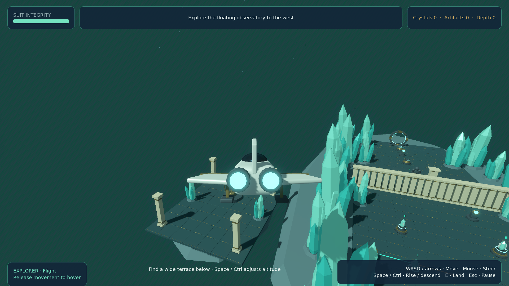

# Milestone 2 — flight and mouse controls

Ari can board the original explorer ship, fly through the Crystal Forest, land on clear
terraces, disembark and board again. A small disconnected observatory gives flight a
place to explore. Unlocked portals carry an occupied ship to the ruins preview or station.
On-foot travel leaves the personal ship in its source dimension at its parked position.

The transparent full-screen HUD previously consumed mouse events before they reached the
camera. Decorative HUD controls now ignore pointer input; menus retain working buttons.
Both cameras use unscaled mouse displacement, shared sensitivity/inversion/FOV settings,
and separate yaw and pitch transforms. Escape releases the pointer and Resume captures it;
losing application focus pauses the game.

Schema 2 adds movement mode and the one ship's dimension, pose and recovery position to
both resume and encounter snapshots. Valid schema-1 saves migrate in memory and are written
as v2 only on a subsequent save. Unsupported versions and validated backup recovery keep
the first milestone's protection. Mid-flight continuation restores the ship hovering.

## Validation

[PR #2](https://github.com/vhar-astro/game-test/pull/2) is the milestone review gate.
Its Actions checks import, test, export and smoke the downloadable Linux artifact.

- Godot 4.7.2 import, actor/world scene smoke tests, original slice traversal, combat,
  v1/v2 persistence and flight integration: `ALL_TESTS_OK`; `Headless checks passed`.
- Real OS input on X11: ground look, blade click, Escape and clicking Resume pass;
  ship look, Escape and clicking Resume return correctly to flight. Reinstating the old
  HUD STOP filter produces zero yaw/pitch change; IGNORE restores mouse look.
  Exact commands/results: [native-mouse.txt](validation/native-mouse.txt).
- Flight fixtures cover obstructed and valid landing, immediate hover, landed/airborne
  fresh-instance continuation, personal-ship isolation across foot portals, occupied-ship
  portal travel, disabled foot actions aboard, bounds recovery, frozen actors during portal
  overlays and safe on-foot return when a parked hull covers the default arrival position.
- Independent Sol review findings were corrected and given regressions where appropriate.
- Linux export succeeds. The exported binary itself runs the staged flight capture below.

The native input tool targets a uniquely titled X11 window through libX11/libXtst and
restores prior pointer/focus afterward. This verifies real host events, not a direct call
to the camera setter. It does not establish native Wayland input behavior. Automated
integration stages distant positions and progression prerequisites; it is not an owner
playthrough or a measurement of first-time understanding.

To reproduce locally:

```bash
./tools/check.sh
./tools/export.sh
python3 tools/validate_mouse_host.py
python3 tools/validate_mouse_host.py --flight --artifact artifacts/mouse_probe_flight.json
python3 tools/validate_mouse_host.py --screen-filter stop --expect-look-blocked --artifact artifacts/mouse_probe_stop.json
./build/infinity-reality/infinity-reality.x86_64 -- --flight-review --flight-output="$PWD/artifacts/flight-review"
```

Use a writable isolated XDG data/config/cache directory for developer runs if the current
shell is sandboxed. Host graphics access is required for the native checks. The game stays
offline. The review flag uses an isolated profile and does not overwrite normal saves.
It stages movement with a visible pointer and suppresses focus pause for capture only;
normal gameplay and native input probes retain focus pause.

## Measured performance and screenshots

Godot 4.7.2 Linux release binary, Mobile/Vulkan, Intel Core Ultra 5 125H / integrated
Intel Arc (Meteor Lake). Actual framebuffer asserted at **1920×1080**, VSync disabled.
Each flight view receives two seconds of warm-up and twelve seconds of camera-sweep sampling.
No concurrent local validation jobs ran during the final measurement. These are staged
rendering measurements, distinct from headless correctness and real input verification.
Raw data: [flight-benchmark.json](validation/flight-benchmark.json).

| Flight view | Mean FPS | p99 frame | Slowest sampled frame (FPS) |
| --- | ---: | ---: | ---: |
| Crystal Forest | 223.07 | 7.181 ms | 111.73 |
| Ruins preview | 222.09 | 7.392 ms | 83.07 |
| Station hub | 233.39 | 6.554 ms | 117.99 |

Transitions: 0.709 s, 0.847 s.
Peak resident memory: **295.94 MiB**.
Linux executable: **71.83 MiB**; compressed package: **28.73 MiB**.

The final sample meets the stated 60 FPS target / 30 FPS minimum. An earlier diagnostic
run with concurrent validation recorded one 131.2 ms hub hitch (7.62 FPS equivalent);
[that report is retained](validation/flight-benchmark-concurrent.json). A subsequent capture
was interrupted by normal focus-loss pause, prompting the developer-only input isolation
above. These observations prevent a claim that every real session is hitch-free. This
benchmark excludes cold import/shader compilation and does not prove performance in later
unimplemented dimensions or on other machines.


[Flight over the forest](screenshots/flight-forest.png) ·
[Landing prompt](screenshots/flight-landing.png) ·
[Immediately after disembarking](screenshots/landing-exit.png) ·
[Observatory](screenshots/observatory.png) · [Russian flight HUD](screenshots/flight-ru.png) ·
[Ruins flight](screenshots/flight-ruins.png) · [Station flight](screenshots/flight-hub.png)



## Scope and choices

The existing concept-approved ship, Ari rig, animations and Blender sources are reused.
No new asset generator or triangle-budget expansion is needed. Landing uses five support
rays, an 8° slope limit, a 0.25 m support-height tolerance, hull and swept-descent checks,
and a free standing capsule for disembarkation. Takeoff checks overhead clearance.
Flight speed is 16 m/s, with immediate hover on release, ±60° pitch and visual auto-leveling.

Pause → station while aboard carries the ship to the station; using the same menu on foot
leaves it parked in its source world. Portal use still requires the existing crystal gate.
Weapons, abilities, puzzle interaction and reward pickup are disabled aboard. Player health
is preserved; boarding is not a healing action. Crossing the flight boundary recovers above
the latest landing/destination launch pose. Save-and-quit during a handoff retains the last
coherent source snapshot.

This does not complete an authored dimension. Further puzzles, bosses, procedural worlds and a final owner playthrough are outside
this milestone. Ship combat remains excluded by the accepted design.
