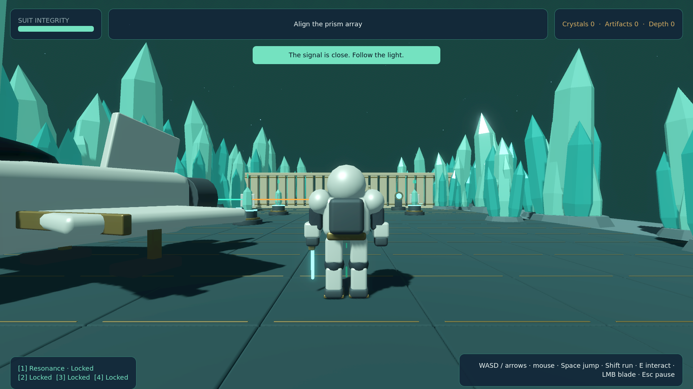

# Milestone 1 validation

Local validation complete. GitHub Actions runs the same checks plus a packaged-binary smoke test;
its live result is attached to the PR. The owner playtest remains the milestone review gate.

## Executed checks

- Blender 5.2.1 original asset generation: ALL_ASSETS_OK. All 14 model budgets pass;
  explorer 3,772 triangles, sentinel 3,744, ship 2,488. GLB animation tracks are imported.
- Godot 4.7.2 headless import and all six authored/actor scenes: clean.
- Combat, progression, save recovery, future-schema protection, physics LOS/navigation,
  LOST-state reacquisition and input-driven full slice traversal: ALL_TESTS_OK.
- Continue-game is tested at progression boundaries and on a freshly created game instance
  after freeing the original. Revisit and checkpoint rollback preserve committed progress.
- The independently launched exported Linux executable: EXPORT_SMOKE_OK, no runtime errors.
- All eight real Mobile/Vulkan screenshots below are 1920x1080. Later scene states are staged
  for visual QA; screenshots are not evidence of input-driven completion.
- Independent review findings were fixed, including camera clipping behind the arrival
  portal, stale edge distortion in puzzle mode, interaction animations and UI geometry.

## Measured rendering performance

Native exported Godot 4.7.2 Mobile/Vulkan; Intel Core Ultra 5 125H with integrated Intel Arc,
Mesa 25.0.7. The actual framebuffer is **1920x1080**, explicitly measured and asserted.
Fullscreen host window is 1920x1200; the game framebuffer retains its 16:9 aspect ratio.
High graphics, VSync disabled. Each location is sampled for 12 seconds after 3 seconds of
warm-up while the camera sweeps. Source data: [benchmark.json](benchmark.json).

| Location | Mean FPS | p99 frame time | Slowest sampled frame (FPS) |
| --- | ---: | ---: | ---: |
| Crystal Forest | 155.57 | 21.573 ms | 37.31 |
| Ruins preview | 165.51 | 22.837 ms | 37.68 |
| Station hub | 165.37 | 23.585 ms | 38.62 |

Portal transitions: 0.835 s, 0.833 s.
Peak resident memory: not recorded in this milestone-1 report. The milestone-2 report
contains a measured exported-build peak.
Linux package: approximately 29 MB compressed; executable approximately 72 MB.

This is a staged rendering benchmark on the named machine. It excludes initial import,
first-ever shader compilation and later unimplemented dimensions. It is distinct from
headless correctness testing and does not establish performance on every integrated GPU.

## Rendered screenshots

[Forest](screenshots/forest.png) · [Prism puzzle](screenshots/puzzle.png) ·
[Boundary decay](screenshots/boundary.png) · [Ruins](screenshots/ruins.png) ·
[Hub](screenshots/hub.png) · [Menu](screenshots/menu.png) ·
[Pause](screenshots/pause.png) · [Russian settings](screenshots/settings-ru.png)

## Review boundary

This is one puzzle, one ordinary robot, a parked ship, one artifact/device interaction,
portal travel and a station return. Full ship flight, shield-disruption combat, authored
bosses, three puzzles per complete dimension and procedural generation are later reviewed
milestones. They are not completion claims for this PR.

First-time understanding, artifact pacing within 15 minutes and the later complete first
level's 30-minute owner playthrough remain human acceptance criteria. Automated traversal
cannot establish those human measures.
